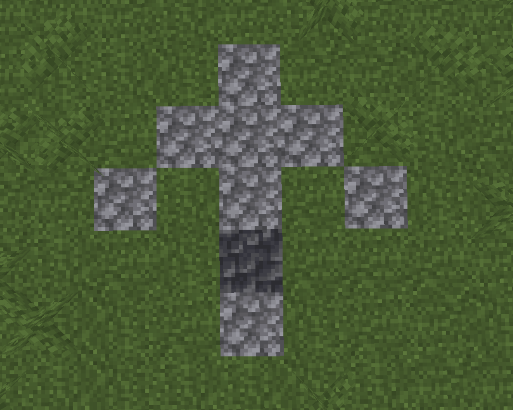

# Von neuman MC
Von neuman probes in minecraft using CC: tweaked

```turtle/``` contains the lua code required to initialize a connection with the python server

```server/``` contains the python code for turtle communication and user inputs

## server-side configuration

config.py has multiple variables that need to be manually filled in

arrow X,Y,Z needs to be specified
this will be used as a "spawn" point for the turtles and a position calibrator

turtles need to be placed facing north

